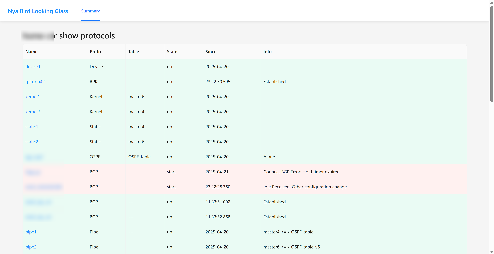
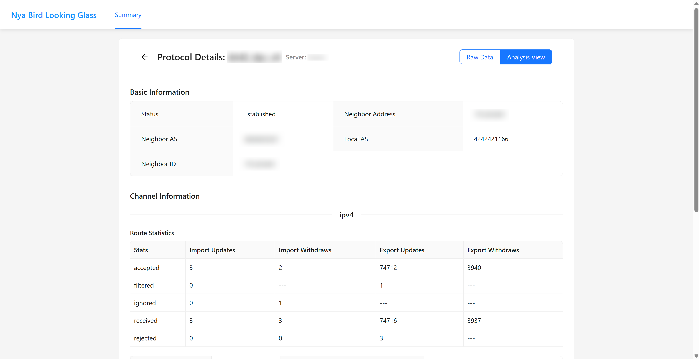

# nya-bird-lg-go

## This project is still under development
## 本项目还在开发中

A BIRD2 looking glass tool developed with Go and Vue (Ant Design).

## Introduction

nya-bird-lg-go is a lightweight BIRD2 looking glass tool that provides a friendly web interface to help users query and analyze BGP routing information. It can be used with the original [bird-lg](https://github.com/sileht/bird-lg) or the [bird-lg-go](https://github.com/xddxdd/bird-lg-go) implementation.

## Features

- Modern web interface based on Vue and Ant Design
- Support for viewing routing information from multiple BIRD2 instances
- Protocol summary view for quick understanding of routing status
- Detailed BGP session information viewing
- Route query functionality with various filtering options
- Responsive design supporting mobile devices

## Screenshots

## Acknowledgements

This project was inspired and helped by the following projects:

- [bird-lg-go](https://github.com/xddxdd/bird-lg-go) - Provided initial design ideas and implementation reference
- [anycast.ink/lg/](https://anycast.ink/lg/) - Provided UI/UX reference and feature inspiration

## License

[MIT License](LICENSE)
